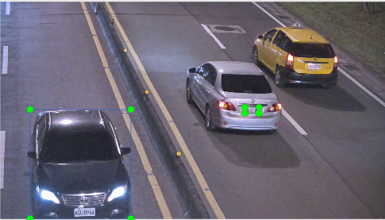
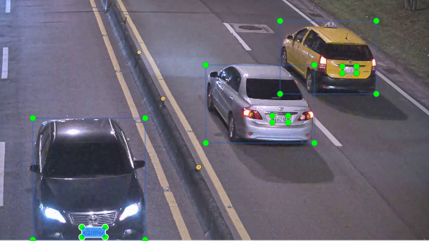
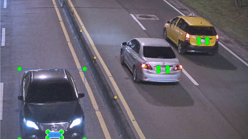

# annotation
## 安裝
- pip
    ```shell
    pip install -U git+http://192.168.0.116:10080/damon/annotation_tool.git
    ```

- clone & copy to your project
    ```shell
    git clone http://192.168.0.116:10080/damon/annotation_tool.git
    cd annotation_tool
    cp -R annotation /path/to/your/project/
    ```

## 使用

### FolderAugmenter : iaa.Augmenter 再封裝 (folder --> folder)
- class FolderAugmenter(self, src_root, src_type, walk=True):
  - src_root : folder path
  - src_type : 'labelme' / 'labelImg'
  - walk: bool

```python
import imgaug.augmenters as iaa
from annotation import FolderAugmenter

faug = FolderAugmenter('srcfolder', src_type="labelme", walk=True)

print(faug.relpaths)  # ['1.json', '2.json', ...]
print(faug.imgpaths)  # ['1.jpg', '2.jpg', ...]
```
- methods:
  - augment(self, seq, dst_root=None, dst_type=None, prefix=None, postfix=None, overwrite=False):
    - seq: iaa.augmenter / iaa.seq
    - dst_root: aug後的圖檔/標記檔路徑，若為 None 則會存在 src_root
    - prefix/postfix: aug後圖檔/標記檔檔名
    - dst_type: None / 'labelme' / 'labelImg'
    - overwrite: bool, 若為 False 則在目標路徑存在時 raise FileExistsError
    - example: 旋轉30度、並將圖片命名為 'rot30_%' (不儲存標記檔)
    ```python
    faug.augment(iaa.Rotate(30), prefix='rot30', overwrite=True)
    ```
    - example: 旋轉-30度、並將圖片命名為 'rot_%_n30'、並儲存 labelImg .xml 標記檔
    ```python
    faug.augment(iaa.Rotate(-30), prefix='rot', postfix='-30', dst_type='labelImg', overwrite=True))
    ```

### Labelme .json --> LabelImg .xml
```python
from annotation import LabelmeJSON
json_path = 'example/img320191126_TaipeiRoadNH_night1.json'
json_ = LabelmeJSON(json_path)
```

- 將 Labelme 的 .json 直接轉換成 LabelImg 可以讀的 .xml
    1. 用 LabelmeJSON.to_labelImg(), 忽略 polygon
        ```python
        xml = json_.to_labelImg()
        xml.save()
        ```
        

    2. 用 LabelmeJSON.to_labelImg(), 將所有 polygon 轉換成  rectangle
        ```python
        xml = json_.to_labelImg(poly2rect=True)
        xml.save()
        ```
        
    
    3. 用 LabelmeJSON.to_labelImg(), 僅將 label 為"p"的 polygon 轉換成  rectangle
        ```python
        xml = json_.to_labelImg(poly2rect=True, poly2rect_labels=['p'])
        xml.save()
        ```
        


# API
## image
- image.ImageFile()
- image.Image()

## shape
- shape.Point()
- shape.Rectangle()
- shape.Polygon()

## AppBase
各種 annotation tool 產生的 annotation 格式
- labelimg.LabelImgXML()
- labelme.LabelmeJSON()
  - .to_labelImg(self, poly2rect=False, poly2rect_labels=None, xml_path=None)
  
- retinaface.RetinaFaceTXT()
- retinaface.RetinaFaceLine()

## Augmenter
- FolderAugmenter()
  - .augment